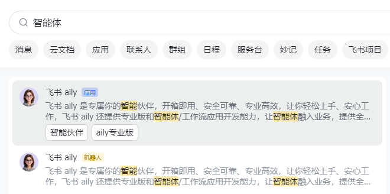
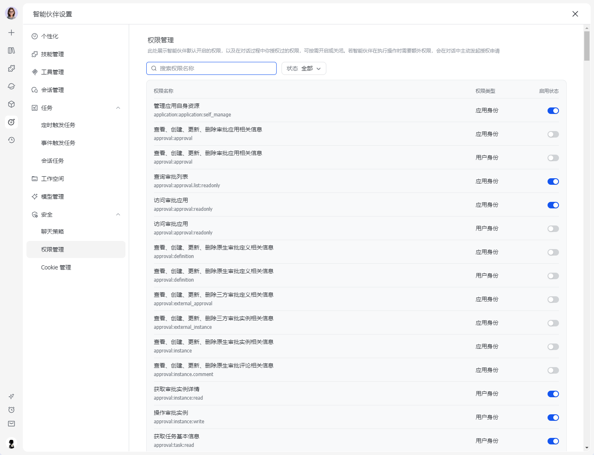

# Animetrack · 飞书制片表智能体 Skill

> **Feishu (Lark) Aily agent skill for anime / animation production tracking** — 给动画/番剧/短片制作团队用的飞书智能助手。让 Aily 智能体懂你的多维表格制片表，你说人话它就能改、能算、能催、能分配。

[](LICENSE)
[](https://github.com/XiaoChu-1208/Animetrack-feishu-agent-skill/issues)
[](https://github.com/XiaoChu-1208/Animetrack-feishu-agent-skill/stargazers)

**关键词 / Keywords**：
`飞书智能体` · `飞书 Aily` · `Lark agent` · `多维表格` · `Feishu Bitable` ·
`动画制片` · `Anime production tracker` · `镜头管理` · `Shot tracking` ·
`分镜表` · `Storyboard` · `排期工具` · `Scheduling` · `自动化工作流` · `Workflow automation` ·
`制片管理` · `Production management` · `LobeChat 飞书版` · `Aily skill`

**一句话**：不是开发者也能用。装一次 5-10 分钟，之后只用聊天发指令。

**导航**：
- [→ 这是个啥](#这是个啥) | [→ 谁能用](#谁能用) | [→ 安装步骤](#安装步骤6-步) | [→ 装完能干啥](#装完之后能干啥举例) | [→ 27 条 Q&A](#常见问题-qa)
- 进阶：[BOOTSTRAP.md](BOOTSTRAP.md) 首次接入 · [SKILL.md](SKILL.md) 智能体规则 · [docs/glossary.md](docs/glossary.md) 中英术语 · [docs/use-cases.md](docs/use-cases.md) 8 个真实场景

---

## 这是个啥

你团队大概率已经在用飞书多维表格管镜头。每天人工：填字段、改截止、追谁谁谁还没交、估完成度、分卡——又烦又容易漏。

这个 skill 把上面这些事全教给一个飞书 Aily 智能体。装完之后：

- 你说「**S1C005 改截止 5/20**」 → 它改掉。
- 你说「**现在完成度多少**」 → 它给你一份带"加权 / 平均 / 风险点"的报告。
- 你说「**S1C008 要返修，对白不对**」 → 它把这镜头退回返修中、写备注、私信负责人。
- 你说「**小明加入了，做清线 A 卡**」 → 它在团队表加一行，下次分配会考虑他。
- 早上有人延期了 → 它私信对方（**不发群**），给你一份汇总。

完全不需要写代码、不需要懂 API。

---

## 这张 .base 制片表凭啥？（特色 & 用法）

> 你不一定要用这张模板——智能体也能读你自己的表（[Q3](#q3)）。但用这张省最多事，因为 **46 个字段 + 10 个视图 + 13 个自动化**全部预配好了。

### 7 个开箱即用的特色

#### 1. 进度字段"自己走"——上传图就推进，不用动鼠标

主进度字段是飞书的 **Stage 类型**，配置成 `NextStage` 模式。意思是：

- 你给某镜头上传一张「清线」图 → 进度从 `原画` **自动跳** `清线`
- 你再上传「上色」图 → 自动跳 `上色`
- 上传「合成」图 → 跳 `合成`，再传一次确认 → `已结束`

**你不用手动去改下拉框**。返修要回退时手动设成 `返修中` 即可，自动化会联动其他字段。

#### 2. 难度加权——S/A/B/C 卡按工时占比，进度算得真实

每个镜头标个难度（`fldR8qXhdV` 字段）。完成度报告会自动按权重算：

| 难度 | 总工时 | 含义 |
|---|---|---|
| S | 23 工作日 | 主角大特写 / 复杂动作 / 关键剧情 |
| A | 16.5 工作日 | 重要镜头 / 多角色互动 |
| B | 11 工作日 | 普通镜头 / 对话戏 |
| C | 6.5 工作日 | 一镜空镜 / 转场 / 远景 |

**1 张 S 卡 ≈ 3.5 张 C 卡的工作量**。完成度报告同时给「加权 / 平均 / 差额」三个数，让你看出来是先啃硬骨头还是把简单的先吃完了。

#### 3. 7 工序 4 并行轨——和真实动画流水线对齐

```
参考 ─→ 角色原画 ─→ 清线 ─→ 上色 ──┐
                                    ├─→ 合成
        绘景 ────────────────────┤
        3D/特效 ──────────────────┘
```

绘景和 3D 不挡原画，可以并行推进。合成是最终汇合点。**比那种只有"未开始/进行中/已完成"三档的简陋表能精细管很多**。

#### 4. 4 个到期自动催——制片不用盯日历

base 里内置 4 个 `datetimeField` 触发器，到截止日当天自动给负责人发飞书消息：

| 触发字段 | 文案（口语版，制片自己写的） |
|---|---|
| 清上终点 | 「宝你的清上结束了吗要交付了」 |
| 绘景终点 | 「宝你的场景结束了吗要交付了」 |
| 角色原画终点 | 「宝你的原画结束了吗要交付了」 |
| 3D 终点 | 「宝你的 3D 结束了吗要交付了」 |

想改成正式语气直接到飞书自动化里改文案即可。

#### 5. Aily 智能体内置 3 条问答自动化

base 里已配好 3 条 `larkMessage` 触发自动化，飞书智能体收到下列问题直接对接 base 数据回答：

- 「整体项目进度怎么样」 → 调 `wkfHL3tkPgDKDZuM`
- 「S1C005 怎么样了」（单镜头查询） → 调 `wkfLjTI1aOPOKjlp`
- 「今天有什么更新」 → 调 `wkfhrAn8X6jGfhUE`

加上每天定时（cron）发更新摘要的 `wkfw1UINiG9ZXf8q`，制片每天早上不用进表也能看到全局。

#### 6. 双里程碑（DDL + ☠️）——软死线 + 硬死线

milestoneMap 里两个硬节点：

- **DDL**（`mlsGqRT4`）：项目正式交付日，所有阶段终点不该超过它
- **☠️**（`mlsAgWxg`）：二次延期临界，过这个就该考虑砍镜头或退档了

智能体排期时会自动检查不能跨 DDL，跨了会列出来让你决定压缩还是推 DDL。

#### 7. 一键归档切下一部

项目做完了说「开新项目叫《X》」，智能体会：

1. 把当前主表整张复制为「{旧名} · 归档 YYYY-MM-DD」
2. 主表清空记录但**保留 46 个字段、10 个视图、13 个自动化**
3. 主表改名为新项目
4. 团队配置和里程碑可选保留 / 重设

**自动化不重配，下一部直接接着用**。这是 .base 模板比一次性 Excel 牛的地方。

---

### 表里到底有啥（数据全景）

| 字段类别 | 数量 | 举例 |
|---|---|---|
| 标识 / 描述 | 7 | 序号、场次镜头号、模块、难度、镜头描述、场次、缩略图文件名 |
| 附件（图片归档目标） | 7 | 镜头缩略图、参考、角色原画、清线、绘景、上色、返修内容 |
| 阶段完成状态 | 9 | 是否定稿、各阶段是否完成、合成进度 0-2、主进度 Stage |
| 负责人（飞书人员字段） | 8 | 原画 / 清线 / 上色 / 绘景 / 3D / 合成 / 参考 / 补充任务 |
| 排期日期（始/终） | 12 | 6 个阶段 × 始终各一 |
| 系统自动 | 3 | 最后更新时间、修改人、补充任务 |

**10 个视图**：概览 · 人员分配 · 角色原画 · 参考 · 清线 · 上色 · 绘景 · 3D/特效 · 合成 · 超级简单进度图（带甘特图，按负责人分组、按完成状态着色）

**13 个自动化**：4 催交付 + 5 阶段流转联动 + 3 智能体问答 + 1 每日定时

---

### 怎么用（最简流程，6 步）

1. **导入表**：飞书 → 新建多维表格 → 从 .base 导入（详见安装步骤第 2 步）
2. **建镜头**：在「概览视图」按场次一行行填，**至少填 5 个字段**：
   - `序号`（主键，**`S1C001` 格式**，不要填裸数字 `001`。S=Scene、C=Cut）
   - `场次镜头号`（和 `序号` 一致，比如 `S1C001`）
   - `镜头描述/备注`（一句话剧情）
   - `难度`（S/A/B/C）
   - `场次`（S1/S2/S3 下拉选，要和 `序号` 的 S 前缀对应）

   其他字段让智能体补 / 你慢慢加。
3. **分配 + 排期**：跟智能体说「现在批量排个期，DDL X 月 X 日」，它会按工时矩阵 + 工序依赖 + 并发上限算出来给你预览，回「确认」落库。
4. **干活**：各负责人按视图工作（清线师只看清线视图、主美只看绘景视图），到时间往对应附件字段上传文件 → **进度自动推进**。
5. **过程管理**：制片随时问智能体：
   - 「完成度多少」 → 加权 + 平均 + 风险
   - 「谁今天延期了」 → 私信发出 + 摘要
   - 「张三手上有几张」 → 个人在手清单
6. **收尾**：项目做完说「开新项目」，智能体一键归档 + 重置主表，进入下一部。

---

## 谁能用

- 制片人 / 导演 / 主美 / 项目经理 / 任何拿着多维表格管事的人
- 单人也能用，团队几十人也能用
- 用飞书企业版 / 个人版都行（个人版要确认你们能开 Aily）

---

## 你需要准备啥

| 准备项 | 说明 |
|---|---|
| 飞书账号 | 公司的或个人的都行 |
| 多维表格 | 可以新建，也可以用你现在已有的制片表 |
| Aily 智能体权限 | 找企业管理员开（如果是个人版去飞书官网申请） |
| 5-10 分钟 | 装一次，以后不用再装 |

---

## 安装步骤（6 步）

### 第 0 步：在飞书里开个智能体

打开飞书 → 顶部搜索框 → 输入「**智能体**」→ 点击 **飞书 aily** 应用：



进去之后点「**智能伙伴**」创建一个新的（这个智能体本质上是飞书集成的 LobeChat 那一套，长得熟）。

> 没出现 aily 应用？那是你们公司还没开通——找飞书管理员开「飞书智能伙伴 / aily」即可。个人版用户去飞书官网申请。

### 第 1 步：下载这个文件夹

最简单的方法：点这个 repo 右上角绿色 **Code** 按钮 → **Download ZIP** → 下载到电脑 → 解压。

或者会用 git 的话：
```bash
git clone https://github.com/XiaoChu-1208/Animetrack-feishu-agent-skill.git
```

解压后是一个文件夹，里面有一堆 `.md` `.json` 文件和一个 `.base` 文件。**别删任何东西**。

### 第 2 步：把 `.base` 文件导入飞书多维表格

> 如果你已经有一张制片表想沿用，**跳过这步**。直接到第 4 步把现有表的链接给智能体。

1. 打开飞书 → 我的空间（或团队空间）
2. **新建** → **多维表格** → 选 **「从 .base 文件导入」**
3. 选文件夹里的 `制片表 v4.1 （公版） .base`
4. 等几秒，得到一张空表（含 46 个字段、10 个视图、13 个自动化全配好）
5. **复制这张表的网址**（浏览器地址栏那一长串），先存着

### 第 3 步：把整个文件夹打成 zip 上传 Aily

1. 选中整个 `制片表v4.1SKILL_feishu` 文件夹 → **右键 → 压缩成 zip**（Mac 是「压缩」，Windows 是「发送到 → 压缩文件夹」）
2. 打开飞书 Aily 管理面板 → 你的智能体 → **知识库**
3. **上传** → 选这个 zip
4. 等它处理完（一般几十秒）

### 第 4 步：给智能体写一句"人设"

在智能体的「**人设/指令**」里粘贴这段话：

> 你的所有规则、字段映射、流程规范都在 `SKILL.md` 里。每轮会话**先 read SKILL.md 和 runtime.json**。如果 `runtime.json` 里 `bound_base.app_token` 为空，按 `BOOTSTRAP.md §3` 流程问用户要 base 链接。回复风格按 SKILL.md 顶部的「短、平、柔」三原则——短话、不渲染严重、不催促。

### 第 5 步：第一次找它说话

打开和智能体的聊天，**第一句话**直接发：

```
我的制片表在这里：[第 2 步复制的链接]
项目叫《XXX》，DDL 大概 8 月 30 日。
```

智能体会自动绑定，回你「绑好啦：《XXX》→ {链接}」。然后就可以正常聊天了。

---

## 权限管理（缺权限怎么办）

智能体调用飞书功能（读多维表格、发消息、@ 人）需要对应权限。**装完一般默认够用**，但如果某次操作智能体回你「我没有 X 权限」，按下面这步走。

**位置**：智能体头像 → **智能伙伴设置** → 左栏 **安全** → **权限管理**



**操作**：

1. 智能体回的报错里通常带一个**权限标识符**，形如 `bitable:app`、`im:message:send_as_bot`、`approval:approval` 这种冒号分隔的小写字符串
2. **复制这串标识符**到顶部的「**搜索权限名称**」框
3. 找到后点右侧的 **启用状态** 开关打开
4. 回到对话告诉智能体「权限给你了」，它会自动重试

**最常用的权限**（提前打开能少踩坑）：

| 权限标识 | 用途 |
|---|---|
| `bitable:app` 或 `bitable:app:readonly` | 读 / 读写多维表格（最重要，没这个啥都做不了） |
| `im:message:send_as_bot` | 智能体身份发飞书消息（私信负责人） |
| `im:message` | 处理消息相关（如查询历史） |
| `contact:user.base:readonly` | 读飞书联系人信息（用于 @ 对应人员） |
| `application:application:self_manage` | 管理智能体自身资源（一般默认开） |

> 看不懂权限标识？直接把智能体报错里那一串原样复制粘贴搜，**不要自己翻译**——飞书的权限名和报错里的标识符是逐字对应的。

> 单位是企业版飞书 + 装的 Aily，部分权限需要管理员二次审批；按钮是灰色点不动 → 找 IT 同事开。

---

## 装完之后能干啥（举例）

聊天发自然语言指令，下面是常见场景：

### 改东西

```
你：把 S1C005 原画截止改到 5/20
它：已改，原 5/15 → 5/20。

你：S1C001 到 S1C008 全部归我做的
它：8 张镜头的"原画负责人"已设为 你。

你：S1C008 要返修，配音不对
它：S1C008 进度退回"返修中"，备注栏写"配音返修"，私信了 张三（角色原画负责人）。
```

### 查东西

```
你：现在完成度多少？
它：【完成度】项目《XXX》
    加权 68.4% / 平均 72.1% / 差额 -3.7%（剩下的偏难，实际比表面慢一点）
    按难度：S 62.5% · A 80% · B 88% · C 100%
    DDL 还有 7 个工作日。
    要看阶段分布、风险清单、或某个人/工序的明细吗？

你：张三现在手上有几张？
它：8 张，3 张原画进行中（S1C002、S1C005、S1C008），5 张未开工。

你：今天有谁延期了？
它：3 张过截止了，私信发了。要看清单吗？
```

### 团队 / 排期

```
你：小明加入了，做清线，能接 A 卡和以下
它：已在"团队配置"加上小明（飞书人员 / 职能=清线 / 卡级=A,B,C / 并发=2）。
    现在还有 5 张清线没分配，要给他派吗？

你：李四离开了
它：已标"离场日期=今天"。李四手上 4 张未完成的清线列在下面，要我重派吗？
   - S1C003、S1C007、S1C012、S1C018

你：现在批量排个期，DDL 8/30
它：【排期预览】
    共 60 张（S 8 / A 15 / B 25 / C 12），合计 380 工作日，DDL 前余 12 天。
    负载靠前：张三 18 张、李四 14 张。
    要看的几处：
    - 张三 8/15 那天 4 张并行（默认上限 2）
    - S1C008 难度未填，先按 B 估
    回「确认」我就落库；要调哪儿告诉我。
```

### 加新功能

```
你：加个每周一早上 9 点自动发周报的功能
它：【新功能计划】每周一周报
    目标：把上周更新汇总私信给项目负责人
    要改：scheduling.json 加 weeklyDigest 配置 / 在 base 加一个 cron 自动化
    用户能感觉到的变化：每周一 9:00 你会收到一条飞书私信，含本周完成镜头、下周目标
    影响：复用现有 wkfw1UINiG9ZXf8q（每日定时反馈）的 cron 模式
    怎么测：先临时设成 5 分钟后触发，看格式对不对
    回滚成本：易（删一个自动化 + 还原配置文件）
    要这样做吗？

你：可以
它：（备份当前文件 → 改 → 测试 → 给你看示例输出）→ 「试用看看，满意回「保留」，不行回「回滚」」
```

---

## 常见问题 Q&A

### A 类：能不能 / 怎么用

### <a id="q1"></a>Q1. 我要会写代码吗？

**A**:不要。装完就是聊天发指令，大白话。

### <a id="q2"></a>Q2. 我的飞书没有 Aily / 找不到 Aily

**A**:个人版的飞书可能要去 [飞书官网](https://www.feishu.cn) 单独申请。企业版的让你们 IT/管理员开通"飞书智能伙伴"或 Aily（不同版本叫法不一样）。

### <a id="q3"></a>Q3. 我已经有一张制片表了，不是从这个 .base 来的，能用吗？

**A**:能。把链接发给智能体，它会自动读你表里的字段。对得上的部分直接当固有字段处理；对不上的会一个一个问你「这字段是干嘛的」，问完就记下了，下次不会再问。

### <a id="q4"></a>Q4. 我能多个项目共用吗？

**A**:能。每个项目对应一张多维表格，但智能体本身可以来回切换。换项目的时候跟它说「换到《另一个项目》的表」，它会备份当前的绑定再切过去。

### <a id="q5"></a>Q5. 多人协作怎么办？

**A**:表本身就是多维表格，团队成员都能编辑。智能体只要绑了同一张表，谁找它说话都行。所有改动都会留下"修改人"和"最后更新时间"，能追溯。

### <a id="q6"></a>Q6. 装完文件夹要留着吗？

**A**:**留着**。里面的配置文件和备份目录是智能体的"长期记忆"。建议放在云盘同步目录（OneDrive / 坚果云 / iCloud Drive 都行），换电脑自动跟着走。

### B 类：操作细节

### <a id="q7"></a>Q7. 多维表格的链接在哪里复制？

**A**:打开你的多维表格 → 右上角「**分享**」按钮 → 「**复制链接**」。

链接可能是这两种格式之一，**两种都行**，智能体都能识别：
- `https://xxx.feishu.cn/base/AbCd1234567890...`（直接 base 链接）
- `https://xxx.feishu.cn/wiki/XYZ987654321...`（放在知识库里的 wiki 链接）

复制完粘贴给智能体就行。

### <a id="q8"></a>Q8. 智能体会自己改我的表吗？怕它乱改

**A**:- **小事**直接做完告诉你（比如改一个截止日）
- **大改动**会先给你看预览：「这样改可以吗？回确认我才动」
- **批量操作**永远先 dry-run，你回「确认」才真的写
- **任何动作**都有备份在 `.history/`，不满意可以让它回滚

### <a id="q9"></a>Q9. 我不想被群消息打扰团队

**A**:默认就**不发群**。所有催延期、提醒都走私信。除非你说「群里发一份」它才会发。

### <a id="q10"></a>Q10. 我嫌智能体话太多 / 报告太长

**A**:SKILL 里有「短、平、柔」三原则约束，默认报告 ≤ 200 字 / 10 行。如果实际还是长，跟它说「下次简短点」，或者在人设里加一句「报告控制在 5 行以内」。

### <a id="q11"></a>Q11. 它说"我现在没有 base 的读写权限"

**A**:看上面 [权限管理](#权限管理缺权限怎么办) 这节——把智能体报错里的权限标识符（比如 `bitable:app`）复制到「智能伙伴设置 → 安全 → 权限管理」搜索框，找到后开启即可。开完告诉智能体「权限给你了」，它会重试。

### C 类：制片相关

### <a id="q12"></a>Q12. 镜头难度 S/A/B/C 怎么算？

**A**:没有硬性标准，由你或主美来定。一般理解：

| 难度 | 大致情况 |
|---|---|
| S | 主角大特写、复杂动作、关键剧情、长镜头 |
| A | 重要镜头、有动作有表演、有多角色互动 |
| B | 普通镜头、对话戏、简单动作 |
| C | 一镜空镜、简单切换、转场、远景 |

填了之后智能体算完成度会按难度加权——剩 5 张 S 卡和剩 5 张 C 卡，对总进度的影响差很多。

### <a id="q13"></a>Q13. 完成度的"加权"和"平均"差别大吗？

**A**:差不大说明你按部就班做；差很多说明结构性问题：
- **加权 < 平均** → 你先做了简单的，难的留到最后，实际比表面慢
- **加权 > 平均** → 你先啃了难的，剩简单尾巴扫尾，风险已基本释放

智能体会同时给两个数 + 差额，让你心里有数。

### <a id="q14"></a>Q14. 我觉得它估的工时不对

**A**:智能体内置的工时表（比如 S 卡原画 5 天、C 卡原画 1 天）是默认值。说「S 卡原画改成 7 天」它会改全局；说「这个 X 镜头特殊，给 10 天」它单独处理这个镜头。

### <a id="q15"></a>Q15. 排期怎么算合理？

**A**:1. 工序顺序约束（必须先原画再清线再上色再合成）
2. 每人并发上限默认 2 张同时做
3. 按难度查工时矩阵
4. 倒推 DDL，留 15% buffer 给返修
5. 跳周末

算出来给你审，**你回「确认」才落库**，没确认前就是预览。

### <a id="q16"></a>Q16. DDL 要赶不上了怎么办？

**A**:跑一次「现在完成度多少 + 风险点」，智能体告诉你：
- 剩多少张
- 按现在节奏什么时候才能完
- 哪些人负载过高

然后决定加人 / 推 DDL / 砍镜头，按你选的方案让它重排。

### <a id="q17"></a>Q17. 团队有人离职 / 离开项目

**A**:说「X 离开了」。智能体不会删人（保留历史归属），只标"离场日期"，把他手上的镜头列出来让你重派。

### <a id="q18"></a>Q18. 一个人能做多个工种吗？

**A**:能。"职能"是多选字段，比如某个人既做清线也做上色，登记时勾两个就行。分配的时候智能体会在两个职能里分别算他的负载。

### D 类：自定义和扩展

### <a id="q19"></a>Q19. 我想加个新字段，比如"配音状态"，能让智能体也认得吗？

**A**:能。你在飞书表里加好字段，下次跟智能体说话它扫到了会问「这字段是干嘛的」，你回答完它就记下，下次不会再问。

### <a id="q20"></a>Q20. 我想加个新功能，比如"导演审稿后自动标记"

**A**:直接说「加个 X 功能」。智能体会先给你写一份**计划**（要改啥、怎么测、能不能撤），等你回 OK 再动手。做完会让你试用，**不满意可以让它回滚**。

### <a id="q21"></a>Q21. 改坏了能撤回吗？

**A**:能。每次大改都备份到 `.history/` 目录，文件名带时间戳。说「回滚到上次」/「撤掉昨天加的那个功能」就恢复。备份保留最近 10 个版本 + 30 天内全部。

### <a id="q22"></a>Q22. 我换电脑了 / 团队换了 / 项目换了

**A**:- **换电脑**：把整个文件夹复制过去就行。如果在云盘同步目录已经自动同步。Aily 那边重新上传 zip。
- **换项目**：跟智能体说「换到 X 表」，它会备份再切。
- **换团队**：人员名单（"团队配置"表）和当前项目绑定，新团队建一张新表就行。

### E 类：故障

### <a id="q23"></a>Q23. 智能体一直问问题不动手

**A**:设计上就是缺信息会问、批量操作会问。如果觉得啰嗦，在人设加一句「小事直接做不用问」。但**大改前还是会问**，这个保护别拿掉，避免误操作。

### <a id="q24"></a>Q24. 智能体回的话出现 ⚠️ 警告 emoji 让人焦虑

**A**:设计上**不应该**这样。SKILL 里明确禁用了告警 emoji。如果遇到，跟它说「报告别用 ⚠️ 这种 emoji」，下次会按规范走。

### <a id="q25"></a>Q25. 智能体认不出我表里某些字段

**A**:正常。你的表可能改过、加过字段。智能体会**主动问你**「这个 fldXXX「{字段名}」是干嘛的」，回答完就记下。问的时候它已经按字段名 + 类型猜了一个用途，你确认或纠正就行。

### <a id="q26"></a>Q26. 我升级了这个 repo 重新上传 zip，会覆盖我的项目数据吗？

**A**:不会。`runtime.json`（你绑的表信息）和 `customizations.md`（你的改动日志）是本地状态，重传 zip 不会动它们。但 `.history/` 备份目录可能会丢，建议先备份一下。

### <a id="q27"></a>Q27. 我可以贡献修改 / 提 issue 吗？

**A**:欢迎。这个 repo 开源，任何 PR / issue / 建议都收。特别欢迎美术团队反馈实际使用中的痛点。

---

## 文件清单

| 文件 / 目录 | 用途 | 谁会读 |
|---|---|---|
| `README.md` | 你正在看的 | 用户 |
| `BOOTSTRAP.md` | 首次接入详细流程 | 用户 + 智能体 |
| `SKILL.md` | 智能体的全部规则手册（15 个章节） | 智能体 |
| `fields.json` | 制片表 46 个字段定义 | 智能体 |
| `workflows.json` | 13 个自动化清单 | 智能体 |
| `team.json` | 团队配置表模板 | 智能体 |
| `scheduling.json` | 排期工时 + 完成度权重 | 智能体 |
| `customizations.md` | 改动日志（运行时 append） | 智能体 |
| `runtime.json` | 当前绑定的 base 信息 | 智能体 |
| `.history/` | 备份目录（运行时产出） | 智能体 |
| `制片表 v4.1 （公版） .base` | 飞书多维表格模板 | 用户（导入飞书） |

---

## 致谢 & 联系

**作者**：小刍

**邮箱**：[chizhu1208@163.com](mailto:chizhu1208@163.com)

**反馈渠道**：
- 有问题、踩到坑、想加功能 → 直接开 [GitHub Issues](https://github.com/XiaoChu-1208/Animetrack-feishu-agent-skill/issues)
- 商务合作 / 私下交流 → 邮件
- 觉得有用 → star 一下让更多动画团队看到

模板「制片表 v4.1（公版）」基于实战项目迭代而来，给所有还在用 Excel 拼制片表的美术团队。

## License

MIT © 小刍
